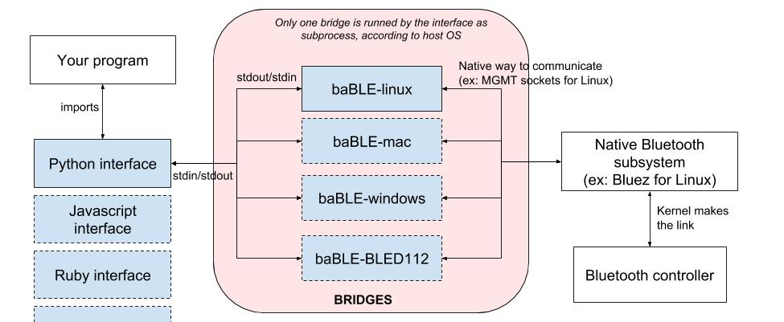

# baBLE

[](https://travis-ci.com/iotile/baBLE)

baBLE is a universal translator from native Bluetooth to a high-level interface,
which can be used by any language, on any platform.

The goal is to (finally) make it simple to use Bluetooth Low Energy, with your favorite language, without worrying about
cross-platform issues on Linux, Mac or Windows.

To do this, baBLE is composed of two parts:

 - **bridges**: written in OS favorite language, a bridge is dependent of the OS, using its API to interact with the
 native Bluetooth system at a low-level. Its goal is to provide a high-level, *universal interface* (formatted with
 [flatbuffers](https://github.com/google/flatbuffers)) through its standard input/output.
 - **interfaces**: written in any language, an interface simply wraps the baBLE commands into functions, to communicate
 with the bridges in a transparent way. *Interfaces are platform-independent.*


*<p align="center">Schema of baBLE principle</p>*

## Progress

The project is still in development.

#### Bridges

|        Platform                                                                    |  Status  |
|------------------------------------------------------------------------------------|----------|
| [Linux (using Bluez)](https://github.com/iotile/baBLE/tree/master/platforms/linux) |    👍    |
| Mac                                                                                |    👎    |
| Windows                                                                            |    👎    |

#### Interfaces

|        Language                                                         |  Status  |
|-------------------------------------------------------------------------|----------|
| [Python](https://github.com/iotile/baBLE/tree/master/interfaces/python) |    👍    |


Feel free to create an interface for your favorite language.

## Getting started

Click on your favorite language in the **Interfaces** table above, to go to the related documentation.


## Troubleshooting

### Linux

#### `ScanResponse` never received

- Verify that you are running an **active scan** and not a **passive scan**. Passive scans just returned advertising
reports, not full scan response. Read the documentation related to the interface you use to run an active scan.

- If you are sure that you are running an active scan, it could be an error with your controller. Indeed, we noticed
that it could happen that Bluez bugs and won't run an active scan even if you ask for. To solve this issue, you need to
restart your controller:

```bash
$ sudo hciconfig dev  # to find your controller id (should start with "hci")
$ sudo hciconfig <controller_id> down
$ sudo hciconfig <controller_id> up
```

#### "Connection failed to be established" error on connection

- Early disconnects are expected BLE failure modes in busy environments where the slave device misses the connection
packet and the master therefore fails immediately. You should simply retry to connect until it works.

#### "Access denied" error on start

- Be sure that either you run it as sudo or that you have given the capabilities to the baBLE bridge executable. Read
the documentation related to the interface you use.

- On Python, if you use `easy_install` to install `bable-interface` (for example via a `python setup.py install`), it
will be installed without the right permission. Indeed, `easy_install` will copy `bable-interface` in your library
without keep the executable permission on the bable bridge executable. To fix this, either add the executable permission
woth `chmod +x <your_python_library_folder>/site-packages/bable_interface/bin/<bable_bridge_executable>` or, simply use
`pip` instead (recommended solution).

### Versioning

We use [SemVer](https://semver.org/) for versioning. For the versions available, see the tags on this repository.
All the bridges and interfaces are using the same version to keep the project coherent.

### License

This project is distributed under the terms of the [MIT license](./LICENSE).
